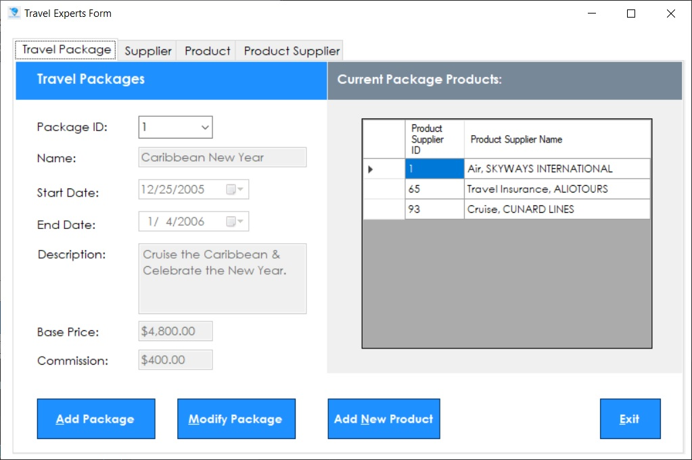
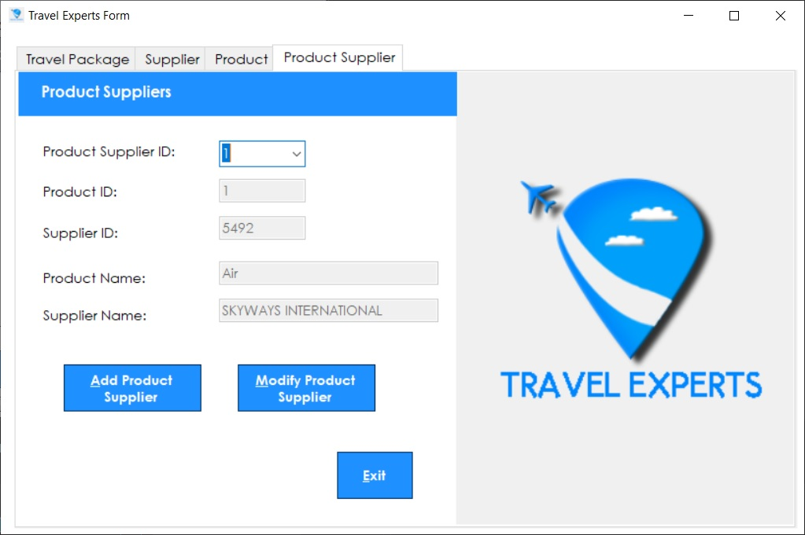

# CPRG-200-Workshop-4

In order that employees of Travel Experts can administer the data stored on their database, they need an application that will provide a graphical interface for viewing and modifying the data. 

There are no restrictions on the interface you choose to build. You are free to design the GUI as your team decides. Ensure that the navigation is user-friendly. Your application will need functionality that will allow the user to maintain the data in the tables listed below. The agents need to add/edit travel packages. This function must allow the user to enter data for the package, and select from a product list to add products to the package.The application will also require simple add/edit access for maintaining the product, suppliers, and product_suppliers data.

Make sure that you validate the data before creating the package:
a)the Agency Commission cannot be greater than the Base Price
b)the Package End Date must be later than Package Start Date
c)Package Name and Package Description cannot be nul

